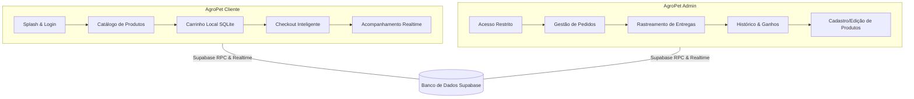

  

<h1 align="center">
  
</h1>

---

# 🐾 AgroPet Lambari — E-Commerce Mobile Multi-App

Seja muito bem-vindo ao repositório do **AgroPet Lambari**, um ecossistema mobile avançado composto por **dois aplicativos isolados** (Cliente e Administrador) desenvolvidos com as melhores práticas de Engenharia de Software, arquitetura robusta e banco de dados de alto desempenho.

## 👨‍💻 Sobre o Desenvolvedor

Olá, Leitor! Meu nome é **Caio Magalhães**, tenho 21 anos e sou graduando em **Sistemas de Informação** no **CEFET-MG** (*Centro Federal de Educação Tecnológica de Minas Gerais*). Como um jovem desenvolvedor apaixonado por arquitetura de software, interfaces imersivas e desempenho mobile, o **AgroPet Lambari** representa o meu primeiro grande marco prático na consolidação de conceitos avançados como transações de banco de dados ACID, desenvolvimento de APIs robustas em tempo real, sincronização offline tolerante a falhas e separação estrita de privilégios.

Este projeto reflete minha dedicação em criar softwares que não apenas resolvam problemas práticos com excelência comercial, mas que também sigam padrões limpos de design, facilitando a manutenção e a escalabilidade técnica.

---

## 💡 Motivação e Características

O **AgroPet Lambari** é um projeto nascido de uma necessidade real de mercado: modernizar a gestão de vendas e o canal de atendimento de uma loja especializada em agropecuária e petshop na histórica cidade de **Lambari, MG**.

### 🌟 Destaques de Negócio
- **Público de Lambari e Região:** Os moradores podem adquirir rações, ferramentas e insumos com entrega ágil em domicílio.
- **Logística Integrada com Raio de 17km:** O aplicativo calcula dinamicamente a geolocalização do cliente. Clientes dentro de um raio de 17km do centro de Lambari podem usufruir da entrega rápida da loja.
- **Integração Externa (Mercado Livre):** Clientes localizados fora do raio limite de entrega da loja física são redirecionados automaticamente para anúncios do estabelecimento no **Mercado Livre**, expandindo a cobertura de vendas sem onerar a logística local.

---

## 🛠 Tech Stack

<table align="center">
   <tr>
      <td align="center">
         
          TypeScript
      </td>
      <td align="center">
         
          React Native
      </td>
      <td align="center">
         
          Expo
      </td>
   </tr>
   <tr>
      <td align="center">
         
          Supabase
      </td>
      <td align="center">
         
          SQLite
      </td>
      <td align="center">
         
          PostgreSQL
      </td>
   </tr>
   <tr>
      <td align="center">
         
          HTML5
      </td>
      <td align="center">
         
          CSS3
      </td>
      <td align="center">
         
          JavaScript
      </td>
   </tr>
</table>

---

## 📱 Estrutura do Ecossistema (Cliente vs Admin)

Para garantir máxima segurança operacional e separação estrita de escopo, o projeto compila **dois APKs totalmente distintos**, impedindo que vulnerabilidades no código do app de e-commerce possam expor dados de faturamento gerenciais da loja.

### 🛍️ AgroPet Cliente (13 Telas)
O aplicativo do cliente foi desenhado com foco em conversão, UX de alta fluidez e resiliência a quedas de conexão:
- **Splash Screen Dinâmico:** Carregamento de marca com verificação assíncrona de sessão.
- **Acesso Integrado (Supabase Auth):** Fluxo de login e cadastro seguro de clientes.
- **Catálogo de Alta Performance:** Filtros rápidos, busca integrada e exibição de detalhes detalhados.
- **Carrinho Local (SQLite):** Persistência robusta que mantém as compras do cliente seguras mesmo com o aplicativo fechado ou em locais com falha de sinal de rede.
- **Checkout Dinâmico:** Opções para pagamento no ato da entrega (PIX, Cartão de Crédito/Débito e Dinheiro).
- **Acompanhar Pedido:** Uma timeline responsiva que exibe o status de envio em tempo real com dados da entrega.
- **Mapa e Geolocalização:** Visualização de rotas, endereços salvos e rastreamento ativo de entregadores.

### 🛡️ AgroPet Admin (10 Telas)
O centro operacional do lojista, focado na gestão rápida do estoque, processamento de pedidos e relatórios de receita:
- **Login Autenticado por Permissão (Role):** Segurança robusta bloqueando acessos não autorizados.
- **Painel de Controle Principal (Hub):** Atalhos rápidos para operações essenciais.
- **Mapa de Logística de Entrega:** Visualização das entregas em andamento e cadastro manual de coordenadas de concorrentes regionais para fins estratégicos.
- **Gerenciador de Pedidos Avançado:** Atualização em tempo real do status das encomendas.
- **Cadastro e Edição de Produtos:** Formulários dinâmicos com upload de imagens e gerenciamento de estoque integrado.

---

## 🛠️ Como o Projeto Funciona (Arquitetura Técnica)

O **AgroPet Lambari** adota conceitos de **Clean Architecture** e **DDD (Domain-Driven Design)**, promovendo baixo acoplamento e altíssima testabilidade. Três grandes pilares de engenharia se destacam no seu funcionamento interno:

### 1. Offline-First com Cache Síncrono (SQLite + Supabase)
A fim de contornar os problemas comuns de internet oscilante no interior de Minas Gerais, o aplicativo implementa uma estratégia robusta baseada em **SQLite (`expo-sqlite`)** para armazenar o catálogo de produtos de forma local. Desta forma:
- O catálogo de produtos é cacheado localmente e carregado instantaneamente.
- O carrinho de compras é totalmente operado offline, sincronizando seus dados de forma transacional e transparente com o **Supabase** apenas no momento da consolidação final do pedido.

### 2. Validação Atômica de Estoque no Checkout (Prevenção de Corrida)
Para solucionar o clássico problema concorrente de múltiplos clientes comprando o mesmo item físico de estoque reduzido ao mesmo tempo, a consolidação de compras é processada na camada de banco de dados do **Supabase** através de uma **Função RPC (`finalizar_pedido`)** escrita em PL/pgSQL:
- O sistema executa instruções `SELECT ... FOR UPDATE` travando as linhas dos respectivos produtos durante a transação.
- **Garantia ACID:** Caso o estoque total seja decrementado a zero antes de uma das solicitações, a transação correspondente sofre rollback e o app exibe uma mensagem de erro amigável.
- **Trigger de Auto-Desativação:** Um gatilho automático (`auto_deactivate_product`) desativa instantaneamente a exibição do produto no catálogo do cliente quando o estoque atinge zero, reativando-o assim que o estoque for reposto pelo administrador.

### 3. Rastreamento e Sincronização GPS em Tempo Real
A arquitetura de rastreamento do entregador utiliza a capacidade reativa do **Supabase Realtime**:
- O dispositivo do entregador (App Admin), sob permissões nativas de geolocalização (`expo-location` operando em segundo plano), grava dados na tabela transacional `delivery_tracking` em intervalos periódicos.
- O aplicativo cliente assina esse canal e recebe as coordenadas via WebSockets.
- Para evitar a sensação de "saltos" do carro no mapa decorrentes de oscilações de sinal, o app do cliente implementa técnicas de **interpolação e suavização gráfica** no componente de mapa (`react-native-maps`), entregando ao usuário final um rastreamento limpo e com deslizar contínuo.

---

## 🚀 Funcionalidades Futuras (Backlog de Inovação)

Novas e inovadoras mecânicas de comportamento visual e de negócios estão catalogadas para implementação nas próximas versões:

  

<h1 align="center">
  
</h1>

---

# 🐾 AgroPet Lambari — E-Commerce Mobile Multi-App

Seja muito bem-vindo ao repositório do **AgroPet Lambari**, um ecossistema mobile avançado composto por **dois aplicativos isolados** (Cliente e Administrador) desenvolvidos com as melhores práticas de Engenharia de Software, arquitetura robusta e banco de dados de alto desempenho.

## 👨‍💻 Sobre o Desenvolvedor

Olá, Leitor! Meu nome é **Caio Magalhães**, tenho 21 anos e sou graduando em **Sistemas de Informação** no **CEFET-MG** (*Centro Federal de Educação Tecnológica de Minas Gerais*). Como um jovem desenvolvedor apaixonado por arquitetura de software, interfaces imersivas e desempenho mobile, o **AgroPet Lambari** representa o meu primeiro grande marco prático na consolidação de conceitos avançados como transações de banco de dados ACID, desenvolvimento de APIs robustas em tempo real, sincronização offline tolerante a falhas e separação estrita de privilégios.

Este projeto reflete minha dedicação em criar softwares que não apenas resolvam problemas práticos com excelência comercial, mas que também sigam padrões limpos de design, facilitando a manutenção e a escalabilidade técnica.

---

## 💡 Motivação e Características

O **AgroPet Lambari** é um projeto nascido de uma necessidade real de mercado: modernizar a gestão de vendas e o canal de atendimento de uma loja especializada em agropecuária e petshop na histórica cidade de **Lambari, MG**.

### 🌟 Destaques de Negócio
- **Público de Lambari e Região:** Os moradores podem adquirir rações, ferramentas e insumos com entrega ágil em domicílio.
- **Logística Integrada com Raio de 17km:** O aplicativo calcula dinamicamente a geolocalização do cliente. Clientes dentro de um raio de 17km do centro de Lambari podem usufruir da entrega rápida da loja.
- **Integração Externa (Mercado Livre):** Clientes localizados fora do raio limite de entrega da loja física são redirecionados automaticamente para anúncios do estabelecimento no **Mercado Livre**, expandindo a cobertura de vendas sem onerar a logística local.

---

## 🛠 Tech Stack

<table align="center">
   <tr>
      <td align="center">
         
          TypeScript
      </td>
      <td align="center">
         
          React Native
      </td>
      <td align="center">
         
          Expo
      </td>
   </tr>
   <tr>
      <td align="center">
         
          Supabase
      </td>
      <td align="center">
         
          SQLite
      </td>
      <td align="center">
         
          PostgreSQL
      </td>
   </tr>
   <tr>
      <td align="center">
         
          HTML5
      </td>
      <td align="center">
         
          CSS3
      </td>
      <td align="center">
         
          JavaScript
      </td>
   </tr>
</table>

---

## 📱 Estrutura do Ecossistema (Cliente vs Admin)

Para garantir máxima segurança operacional e separação estrita de escopo, o projeto compila **dois APKs totalmente distintos**, impedindo que vulnerabilidades no código do app de e-commerce possam expor dados de faturamento gerenciais da loja.

### 🛍️ AgroPet Cliente (13 Telas)
O aplicativo do cliente foi desenhado com foco em conversão, UX de alta fluidez e resiliência a quedas de conexão:
- **Splash Screen Dinâmico:** Carregamento de marca com verificação assíncrona de sessão.
- **Acesso Integrado (Supabase Auth):** Fluxo de login e cadastro seguro de clientes.
- **Catálogo de Alta Performance:** Filtros rápidos, busca integrada e exibição de detalhes detalhados.
- **Carrinho Local (SQLite):** Persistência robusta que mantém as compras do cliente seguras mesmo com o aplicativo fechado ou em locais com falha de sinal de rede.
- **Checkout Dinâmico:** Opções para pagamento no ato da entrega (PIX, Cartão de Crédito/Débito e Dinheiro).
- **Acompanhar Pedido:** Uma timeline responsiva que exibe o status de envio em tempo real com dados da entrega.
- **Mapa e Geolocalização:** Visualização de rotas, endereços salvos e rastreamento ativo de entregadores.

### 🛡️ AgroPet Admin (10 Telas)
O centro operacional do lojista, focado na gestão rápida do estoque, processamento de pedidos e relatórios de receita:
- **Login Autenticado por Permissão (Role):** Segurança robusta bloqueando acessos não autorizados.
- **Painel de Controle Principal (Hub):** Atalhos rápidos para operações essenciais.
- **Mapa de Logística de Entrega:** Visualização das entregas em andamento e cadastro manual de coordenadas de concorrentes regionais para fins estratégicos.
- **Gerenciador de Pedidos Avançado:** Atualização em tempo real do status das encomendas.
- **Cadastro e Edição de Produtos:** Formulários dinâmicos com upload de imagens e gerenciamento de estoque integrado.

---

## 🛠️ Como o Projeto Funciona (Arquitetura Técnica)

O **AgroPet Lambari** adota conceitos de **Clean Architecture** e **DDD (Domain-Driven Design)**, promovendo baixo acoplamento e altíssima testabilidade. Três grandes pilares de engenharia se destacam no seu funcionamento interno:

### 1. Offline-First com Cache Síncrono (SQLite + Supabase)
A fim de contornar os problemas comuns de internet oscilante no interior de Minas Gerais, o aplicativo implementa uma estratégia robusta baseada em **SQLite (`expo-sqlite`)** para armazenar o catálogo de produtos de forma local. Desta forma:
- O catálogo de produtos é cacheado localmente e carregado instantaneamente.
- O carrinho de compras é totalmente operado offline, sincronizando seus dados de forma transacional e transparente com o **Supabase** apenas no momento da consolidação final do pedido.

### 2. Validação Atômica de Estoque no Checkout (Prevenção de Corrida)
Para solucionar o clássico problema concorrente de múltiplos clientes comprando o mesmo item físico de estoque reduzido ao mesmo tempo, a consolidação de compras é processada na camada de banco de dados do **Supabase** através de uma **Função RPC (`finalizar_pedido`)** escrita em PL/pgSQL:
- O sistema executa instruções `SELECT ... FOR UPDATE` travando as linhas dos respectivos produtos durante a transação.
- **Garantia ACID:** Caso o estoque total seja decrementado a zero antes de uma das solicitações, a transação correspondente sofre rollback e o app exibe uma mensagem de erro amigável.
- **Trigger de Auto-Desativação:** Um gatilho automático (`auto_deactivate_product`) desativa instantaneamente a exibição do produto no catálogo do cliente quando o estoque atinge zero, reativando-o assim que o estoque for reposto pelo administrador.

### 3. Rastreamento e Sincronização GPS em Tempo Real
A arquitetura de rastreamento do entregador utiliza a capacidade reativa do **Supabase Realtime**:
- O dispositivo do entregador (App Admin), sob permissões nativas de geolocalização (`expo-location` operando em segundo plano), grava dados na tabela transacional `delivery_tracking` em intervalos periódicos.
- O aplicativo cliente assina esse canal e recebe as coordenadas via WebSockets.
- Para evitar a sensação de "saltos" do carro no mapa decorrentes de oscilações de sinal, o app do cliente implementa técnicas de **interpolação e suavização gráfica** no componente de mapa (`react-native-maps`), entregando ao usuário final um rastreamento limpo e com deslizar contínuo.

---

## 🚀 Funcionalidades Futuras (Backlog de Inovação)

Novas e inovadoras mecânicas de comportamento visual e de negócios estão catalogadas para implementação nas próximas versões:

- **Pagamento Nativo por PIX:** Geração inteligente de QR Code *Copy and Paste* dinâmico com suporte para leitor via câmera no app do cliente.
- **Autenticação Biométrica:** Acesso facilitado e seguro ao painel administrativo por meio de FaceID ou impressão digital local (`expo-local-authentication`).

---

## 🕹️ Histórico de Updates Realizados (Sprint de Inovação)

Compilamos abaixo a lista completa de mecânicas de ponta que foram totalmente implementadas e agregadas ao ecossistema do **AgroPet Lambari**:

### ⚡ 1. Resolução de Timeouts RLS e Otimizações de Caixa e Histórico
*   **Fim de Gargalos (Postgres 57014):** Remoção de timeouts com `SET row_security = off` e otimização para menos de 50ms.
*   **Desvinculação Caixa/PDV:** Ledger passa a exibir exclusivamente sangrias e suprimentos manuais.
*   **Histórico de Pedidos Puro:** Oculta vendas do PDV, mostra estritamente pedidos online de clientes.

### 🧪 2. Maximização de Cobertura de Testes e Limpeza Arquitetural
*   **100% Test Coverage:** Testes unitários herméticos em Domain Entities e Value Objects (Order, Product, User, etc.).
*   **Edge Cases:** Testes de timeout assíncrono e tracking com duração nula no AdminMapScreen.
*   **Limpeza Arquitetural:** Remoção de artefatos obsoletos e arquivos *index.ts* vazios.

### 🎨 3. Unificação Global de Caixa e Sincronização UI/UX
*   **Caixa Global Unificado:** Sincronização contábil completa na tela de Histórico de Vendas com `<CaixaGlobalPanel>`.
*   **Reversão Atômica de Estoque:** Devolução de produtos ao estoque com expurgação simultânea do Caixa Global.
*   **Dark Mode Avançado:** SVGs explícitos `*Dark.svg` para forçar cores brancas em interfaces `#000000`.
*   **Bateria Invicta:** 253/253 testes Cliente e 512/512 Admin.

### 🛠️ 4. Refatoração e Bug Fixes Técnicos — 30/05/2026
*   **Modularização Extrema:** Componentes reduzidos de 2.000+ para menos de 400 linhas.
*   **Bugfix Crítico:** Resolução de timeouts no Jest e duplicação sintática na TrackingScreen.
*   **Limpeza Final:** Expurgo de arquivos residuais, logs e scripts locais.

### 🛡️ 5. Patch: Blindagem do projeto, reforma no Banco de Dados e melhorias técnicas — 31/05/2026
*   **Cobertura 100% Admin:** 14 novos arquivos de teste, 100% Statements/Branches/Functions/Lines em 68 arquivos.
*   **13 Migrations SQL (22-34):** Idempotência, Rate Limiter, Estoque Atômico, RLS, Auditoria, Índices, PIX, IDOR, Controle de Concorrência, LGPD, Notificações e Dead-Letter Queue.
*   **Infraestrutura:** Docker multi-estágio, docker-compose, CI/CD GitHub Actions, health check, feature flags.
*   **Push 50M:** Expo Push API com fila e DLQ para 50 milhões de notificações simultâneas.
*   **Offline Sync:** Delta sync incremental com 90% redução de banda e merge automático por timestamp.
*   **15 OpenSpecs:** Documentação viva de todas as iniciativas técnicas.
*   **61 arquivos, +1889 linhas, -310 removidas** — 999 testes.

### ⚖️📡 6. LegalPages e Rastreamento GPS em Tempo Real — 07/06/2026
*   **LegalPages Compartilhado (Cliente + Admin):** Telas de Política de Privacidade e Termos de Uso em ambos os apps, com roteamento dinâmico na `AuthStack` via parâmetro `documentType` e 6 testes unitários validando privacidade, termos, fallback e fechamento.
*   **gpsTrackingService (Admin):** Serviço modular com start/stop monitoramento, atualização periódica de coordenadas no Supabase e tratamento de erros com timeouts. Hook `useGpsTracking` gerenciando o ciclo de vida do tracking no `AdminOrderDetail`. 2 suites de teste com cenários de sucesso, falha de permissão e timeout.
*   **Migration SQL (41):** Script `add_delivery_tracking.sql` para estrutura de persistência do tracking em tempo real.

### 🗺️🐛 7. Delivery Minimap, Correções de UX e Expansão de Testes — 07/06/2026
*   **Componente DeliveryMinimap (Cliente):** Mapa customizado com `react-native-maps`, marcador animado da posição do entregador, polígono de rota e centralização dinâmica da câmera. Hook `useDeliveryMinimap` com assinatura Realtime, interpolação suave de coordenadas e fallback para timeline textual.
*   **Dropdown Fechando ao Tocar Fora:** `onStartShouldSetResponderCapture` no `OrdersScreen` + `closeAllDropdowns()` no botão Detalhes do `OrderCard`.
*   **Correção hasDeparted:** Lógica expandida para incluir status `completed` no AdminMapScreen.
*   **Expansão de Testes:** Cobertura adicional em `shopHours.test.ts` (finais de semana/feriados), `database.test.ts` (transação, rollback, concorrência), `ConnectivityContext.test.tsx` e `coverage-edge-cases.test.tsx`.
*   **58 arquivos modificados, +2726 linhas, -538 removidas** — 363 testes Admin e 145 Cliente, **508 testes automatizados**.

### 🚀📱 8. Configurações Finais, App Icons e Resolução de Crashes Nativos — 08/06/2026
*   **Resolução de JNI Crash:** Correção definitiva do erro fatal na inicialização do aplicativo cliente através do downgrade da dependência `expo-sharing` para a versão compatível com a SDK 54.
*   **Segurança de Navegação:** Implementação de um `<SafeAreaProvider>` global encapsulando o `GestureHandlerRootView` nos dois aplicativos para prevenir falhas silenciosas de renderização do BottomTabs.
*   **Variáveis de Ambiente Seguras:** Configuração avançada do `app.config.js` para injetar segredos como a `GOOGLE_MAPS_API_KEY` diretamente da nuvem da Expo, removendo chaves codificadas (`hardcoded`) do `app.json`.
*   **Identidade Visual (Ícones):** Injeção de App Icons vetoriais personalizados na pasta assets (Fundo Laranja Puro no Cliente, Fundo Azul-Marinho no Admin) e adequação dos Nomes de Exibição dos binários finais (Agropet Lambari e Agropet Admin).
*   **Sucesso no EAS Build:** Geração dos APKs de produção com arquitetura nativa ativada (`newArchEnabled: true`), finalizando a Sprint com sucesso e permitindo o lançamento seguro dos apps nos dispositivos.

### 👑🔐 9. Modo Deus, OTP Nativo e Refatorações de Autenticação — 11/06/2026
*   **Modo Deus (Admin):** Login unificado inteligente em `AdminLoginScreen`. Identifica emails normais vs códigos de 8 dígitos gerados aleatoriamente via Supabase Edge Function (`smooth-worker` com Resend). Acesso root concedido via tabela `admin_auth_codes` com elevação automática para role `dev`/`admin`.
*   **Autenticação OTP Nativa (Cliente):** Substituição do fluxo de confirmação baseada em Magic Links para uma verificação local baseada em códigos OTP de 6 dígitos. Criação da `OTPVerificationScreen` e injeção do componente no Stack Navigator para capturar `signUp` e `recovery`.
*   **Modificações de Email Templates:** Atualização dos templates de "Confirm Signup" e "Reset Password" para exibição elegante do `{{ .Token }}` em formato HTML injetável.
*   **Aprimoramento de Build e Dependências:** Atualização silenciosa OTA para `preview` via EAS Update e estabilização de dependências Sentry (`promise` polyfill).

### 🛒📦 10. Suporte a Produtos a Granel, Caixa Registradora, Filtros e Infraestrutura (NOVO!!!) — 13/06/2026
*   **Venda Fracionada (Bulk Products):** Implementação completa de produtos vendidos a granel. Toggle interativo com seletor de unidade (`Kg/g`), exibição dinâmica de sufixos de preço ("R$ XX,XX /Kg") no catálogo do cliente, conversão atômica de peso e exibição consistente em todos os pontos (ProductCard, PDV, Detalhes).
*   **Sistema de Caixa Registradora Persistente:** Criação de arquitetura financeira com quebra detalhada por método de pagamento (Crédito, Débito, PIX, Dinheiro). Painel em tempo real de saldo (vermelho/verde), saques operacionais, tela dedicada de movimentação (`CashRegisterScreen`) e histórico com filtros de período.
*   **Gestão de Categorias e Frete Dinâmico:** Gerenciamento nativo de Categorias (CRUD completo, filtros e sincronia com o Cliente via `useCategories`). Sistema de entrega bloqueável pelo lojista, ocultando o minimapa e interrompendo educadamente tentativas de checkout na ponta do consumidor.
*   **Gráficos SVG e Animações Fluidas:** Nova Chart de Performance de Vendas com curva *teal* customizada no Admin (filtro por data única ou período). Micro-interação visual no input de estoque, que contrai suavemente enquanto o sufixo "Kg/g" desliza para a tela de edição.
*   **Autenticação OTP de Alto Privilégio:** Construção da `OTPVerificationScreen` para fluxo de login administrador e injeção da nova `Edge Function` de 8-dígitos via infraestrutura Supabase CLI (`config.toml`).
*   **Cobertura e Organização Refinada:** Recorde de **1003 testes unitários** aprovados abrangendo `formatStock`, ganchos de produto (`useProductEdit`), edge cases, categorias e PDV. Nova arquitetura de pastas limpa na divisão `src/presentation/screens/client/` do AgroPet Cliente.

---

## 🤝 Agradecimento

Muito obrigado por dedicar seu tempo para conhecer o meu projeto **AgroPet Lambari**! Este repositório reflete horas de estudo, refatoração de código e amor pelo desenvolvimento de software de alta fidelidade técnica. Fique à vontade para explorar os arquivos do repositório, propor melhorias no código ou entrar em contato para trocarmos experiências sobre Engenharia de Software e Tecnologias Mobile.

---

## 📞 Contato & Redes Sociais

Caso queira acompanhar minha jornada de desenvolvimento de perto, ver novidades sobre projetos ou discutir parcerias profissionais:

<!-- Modern social links utilizing GitHub badges style -->

---

  © 2026 Caio Magalhães. Todos os direitos reservados. Projetado e construído com 💻, 🧠 e ☕ em Varginha, MG.

