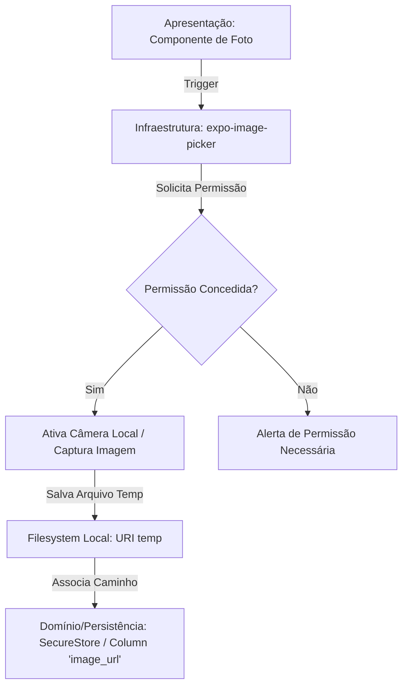
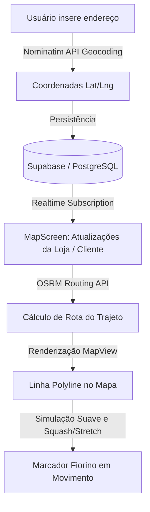

# Especificação Técnica e Arquitetural — Parte 3 do Trabalho
## Sistemas Móveis: Câmera, Geolocalização e Persistência SQLite

Este documento descreve a arquitetura e o mapeamento de código dos módulos de **Câmera**, **Geolocalização** e **Persistência Relacional com SQLite** no projeto **AgroPet Lambari**, divididos em camadas de **Apresentação (Interface)**, **Infraestrutura (Sensores e Arquivos)** e **Domínio/Persistência Local**.

---

## 1. Módulo de Câmera e Pipeline de Evidências

O módulo de Câmera é responsável por permitir que o usuário capture fotos (como o avatar do perfil do cliente ou as fotos dos produtos pelo administrador), salve-as localmente e associe seus caminhos (URIs) aos modelos do domínio.



### A. Apresentação (Interface)
Responsável por renderizar o componente visual da foto, exibir o modal de opções (Câmera ou Galeria) e controlar os estados visuais da imagem capturada.
- **Códigos Relevantes**:
  - `ProfileScreen.tsx` ([linhas 641-678](file:///c:/Users/Gamer/OneDrive/Área de Trabalho/Faculdade Prog/mobaapk/agropet-cliente/src/presentation/screens/client/ProfileScreen.tsx#L641-L678)): Renderiza o avatar circular do cliente, exibindo a foto capturada ou um ícone padrão. Possui o botão "Alterar foto" que aciona as opções.
  - `ProfileScreen.tsx` ([linhas 1087-1096](file:///c:/Users/Gamer/OneDrive/Área de Trabalho/Faculdade Prog/mobaapk/agropet-cliente/src/presentation/screens/client/ProfileScreen.tsx#L1087-L1096)): Modal de seleção que permite ao usuário escolher entre capturar com a Câmera ou selecionar da Galeria.
  - `ProductCreateScreen.tsx` ([linhas 54-68](file:///c:/Users/Gamer/OneDrive/Área de Trabalho/Faculdade Prog/mobaapk/agropet-admin/src/presentation/screens/admin/ProductCreateScreen.tsx#L54-L68)): Função `openCamera` no painel do administrador para adicionar a foto de um novo produto cadastrado.

### B. Infraestrutura (Câmera e Sistema de Arquivos)
Lida com a API de hardware do aparelho (`expo-image-picker`), solicitando permissões no nível do sistema operacional e gravando a imagem capturada temporariamente no armazenamento interno (`cacheDirectory` do app).
- **Códigos Relevantes**:
  - `SettingsScreen.tsx` ([linhas 348-358](file:///c:/Users/Gamer/OneDrive/Área de Trabalho/Faculdade Prog/mobaapk/agropet-cliente/src/presentation/screens/client/SettingsScreen.tsx#L348-L358)): Método `requestCamera` que executa `ImagePicker.requestCameraPermissionsAsync()`.
  - `ProfileScreen.tsx` ([linhas 590-607](file:///c:/Users/Gamer/OneDrive/Área de Trabalho/Faculdade Prog/mobaapk/agropet-cliente/src/presentation/screens/client/ProfileScreen.tsx#L590-L607)): Executa `ImagePicker.launchCameraAsync` com configurações de qualidade otimizadas (`quality: 0.5`) e retorna um objeto contendo a URI temporária da imagem local do sistema de arquivos (`result.assets[0].uri`).

### C. Domínio e Persistência
Associa a URI do arquivo local ao modelo de dados do usuário/produto, agendando ou gravando o estado para persistência persistente.
- **Códigos Relevantes**:
  - `ProfileScreen.tsx` ([linha 605](file:///c:/Users/Gamer/OneDrive/Área de Trabalho/Faculdade Prog/mobaapk/agropet-cliente/src/presentation/screens/client/ProfileScreen.tsx#L605)): Salva a URI local do avatar de forma persistente utilizando o `SecureStore` do Expo sob a chave `avatarKey` (`SecureStore.setItemAsync(avatarKey, uri)`).
  - Ao carregar a tela (`useEffect`), a aplicação recupera a URI do cache de estado local para garantir que a foto persista mesmo se o app for encerrado.

---

## 2. Módulo de Geolocalização e Mapas

Este módulo orquestra a localização da loja, os endereços do cliente resolvidos via coordenadas, e o rastreamento em tempo real do trajeto de entrega da Fiorino da loja.



### A. Apresentação (Interface)
Renderiza o mapa interativo, pino do estabelecimento, ponto da residência do cliente e o trajeto desenhado, além das animações elásticas da entrega.
- **Códigos Relevantes**:
  - `MapScreen.tsx` ([linhas 723-785](file:///c:/Users/Gamer/OneDrive/Área de Trabalho/Faculdade Prog/mobaapk/agropet-cliente/src/presentation/screens/client/MapScreen.tsx#L723-L785)): Renderiza a biblioteca `react-native-maps` (`MapView`) com pins estilizados (`Marker`) para a loja e o cliente. Desenha também as linhas pretas e azuis do caminho (`Polyline`).
  - `MapScreen.tsx` ([linhas 132-284](file:///c:/Users/Gamer/OneDrive/Área de Trabalho/Faculdade Prog/mobaapk/agropet-cliente/src/presentation/screens/client/MapScreen.tsx#L132-L284)): Componente animado `FiorinoIcon`. Utiliza física de animação com `Animated.sequence` para simular efeitos elásticos de pulo e achatamento (*Squash and Stretch*) quando o veículo muda de direção na rota do mapa.

### B. Infraestrutura (Sensores e APIs de Geolocalização)
Adquire a localização do aparelho através do sensor GPS do dispositivo e consome serviços web de roteamento (OSRM) e geocodificação (Nominatim).
- **Códigos Relevantes**:
  - `SettingsScreen.tsx` ([linhas 360-364](file:///c:/Users/Gamer/OneDrive/Área de Trabalho/Faculdade Prog/mobaapk/agropet-cliente/src/presentation/screens/client/SettingsScreen.tsx#L360-L364)): Solicita permissão de sensor GPS em primeiro plano usando `Location.requestForegroundPermissionsAsync()`.
  - `ProfileScreen.tsx` ([linhas 233-258](file:///c:/Users/Gamer/OneDrive/Área de Trabalho/Faculdade Prog/mobaapk/agropet-cliente/src/presentation/screens/client/ProfileScreen.tsx#L233-L258)): Consome a API do OpenStreetMap Nominatim em background para obter coordenadas aproximadas (`latitude`/`longitude`) a partir da rua, número e bairro inseridos pelo cliente.
  - `MapScreen.tsx` ([linhas 444-508](file:///c:/Users/Gamer/OneDrive/Área de Trabalho/Faculdade Prog/mobaapk/agropet-cliente/src/presentation/screens/client/MapScreen.tsx#L444-L508)): Consome a API pública de roteamento OSRM (`router.project-osrm.org`) para calcular a lista de coordenadas geométricas de tráfego de carro entre a loja de Lambari e a casa do cliente.

### C. Domínio e Regras de Negócio
Define as regras do raio de entrega de 17km configurável a partir do centro urbano de Lambari-MG utilizando cálculo matemático de distância por Haversine.
- **Códigos Relevantes**:
  - `design.md` ([linhas 213-220](file:///c:/Users/Gamer/OneDrive/Área de Trabalho/Faculdade Prog/mobaapk/openspec/changes/agropet-ecommerce-app/design.md#L213-L220)): Especifica a regra de frete. Se o cliente residir fora do limite estabelecido, a API bloqueia a entrega local de forma transparente, forçando "Retirada na Loja" ou envio via Mercado Livre.

---

## 3. Persistência Local com SQLite (Offline-First e Sincronização)

O banco de dados relacional local do aplicativo cliente garante que o carrinho, histórico de pedidos e catálogo de produtos funcionem de modo resiliente, gerenciando cache local e fila de sincronização assíncrona.

```text
  [ Interface / UI ]
         │
         ▼
  [ CartContext / Providers ]
         │
    (Escreve e Lê)
         ▼
  ┌───────────────────────────────────────────────────────────┐
  │ SQLite Local Database (expo-sqlite)                       │
  │                                                           │
  │  1. TABLE cart (Persistência do Carrinho)                 │
  │  2. TABLE products_cache (Catálogo Local Offline)         │
  │  3. TABLE orders_cache (Histórico Offline)                │
  │  4. TABLE sync_queue (Fila de Transações Offline)         │
  └───────────────────────────────────────────────────────────┘
         │
   (Ao voltar rede)
         ▼
  [ SyncQueueService ] ──▶ Sincroniza via RPC/REST ──▶ [ Supabase Cloud ]
```

### A. Modelagem de Dados Relacional (SQLite)
Definida no script de inicialização do banco embarcado `expo-sqlite`, criando as tabelas relacionais de carrinho, cache e controle de sincronização.
- **Tabelas do Esquema**:
  - `cart`: Persiste os dados dos itens adicionados ao carrinho.
  - `products_cache`: Cache do catálogo de produtos baixados.
  - `orders_cache`: Cache local de histórico de pedidos do usuário.
  - `sync_queue`: Fila estruturada para acumular alterações locais offline que devem ser enviadas ao servidor.
- **Código Relevante**:
  - `database.ts` ([linhas 3-50](file:///c:/Users/Gamer/OneDrive/Área de Trabalho/Faculdade Prog/mobaapk/agropet-cliente/src/data/datasources/sqlite/database.ts#L3-L50)): Inicializa a conexão com o banco local `agropet_cart.db` e roda de forma síncrona/atômica os scripts SQL de criação de tabelas e configurações de journaling (`PRAGMA journal_mode = WAL`).

### B. Responsabilidades Arquiteturais
O design segue a separação de responsabilidades para garantir consistência offline-first sem prejudicar a experiência do usuário.

#### I. Operação Offline-first (Carrinho de Compras)
O carrinho de compras opera diretamente sobre o banco SQLite local. Isso garante que o usuário consiga adicionar produtos, editar quantidades e remover itens mesmo sem sinal de internet.
- **Código Relevante**:
  - `CartContext.tsx` ([linhas 45-74](file:///c:/Users/Gamer/OneDrive/Área de Trabalho/Faculdade Prog/mobaapk/agropet-cliente/src/presentation/contexts/CartContext.tsx#L45-L74)): Os métodos `addToCart`, `removeFromCart` e `clearCart` executam comandos SQL estruturados no SQLite local (`db.runAsync(...)`) e depois atualizam o estado local de forma reativa (`loadCart`).

#### II. Fila de Sincronização (Sync Queue Pattern)
Responsável por salvar operações de alteração de banco localmente quando o dispositivo estiver sem conexão e despachá-las ao servidor Supabase assim que a conexão de rede for restabelecida.
- **Código Relevante**:
  - `syncQueue.ts` ([linhas 20-64](file:///c:/Users/Gamer/OneDrive/Área de Trabalho/Faculdade Prog/mobaapk/agropet-cliente/src/data/datasources/sqlite/syncQueue.ts#L20-L64)): Implementa a classe `SyncQueueService` que enfileira mutações de domínio (`enqueue`), lista registros pendentes de envio e orquestra a sincronização assíncrona ao iterar a fila e despachar para as tabelas PostgreSQL do Supabase através do cliente da nuvem.

#### III. Recuperação de Estado e Caching
Ao iniciar a aplicação, a primeira ação dos contextos globais é acessar o banco de dados SQLite local, recuperando o carrinho ativo anterior e fornecendo dados em cache instantaneamente, reduzindo o tempo de carregamento (Cold Start).
- **Códigos Relevantes**:
  - `CartContext.tsx` ([linhas 33-38](file:///c:/Users/Gamer/OneDrive/Área de Trabalho/Faculdade Prog/mobaapk/agropet-cliente/src/presentation/contexts/CartContext.tsx#L33-L38)): `useEffect` aciona `initDB` e carrega o carrinho salvo no SQLite (`loadCart`) antes de a interface ser completamente desenhada, recuperando o estado da última sessão.
  - `syncQueue.ts` ([linhas 70-112](file:///c:/Users/Gamer/OneDrive/Área de Trabalho/Faculdade Prog/mobaapk/agropet-cliente/src/data/datasources/sqlite/syncQueue.ts#L70-L112)): Implementa o `ProductCacheService`, que persiste temporariamente a lista de produtos no banco SQLite local (`products_cache`) para visualização offline instantânea do catálogo.
