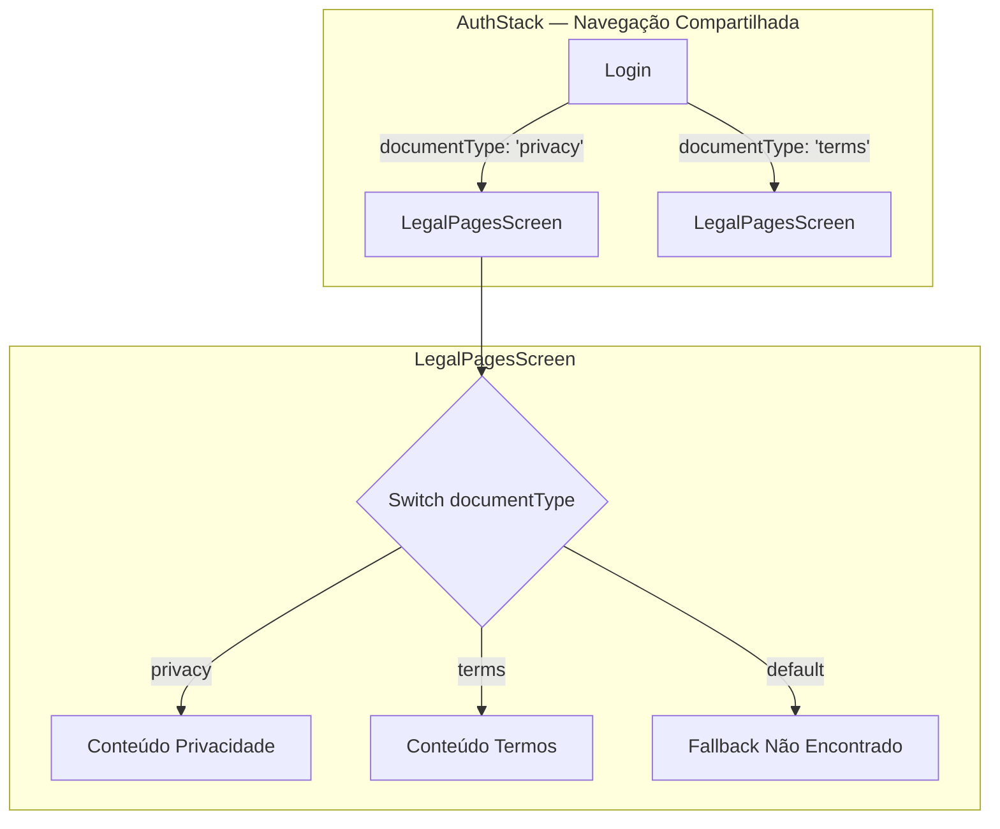
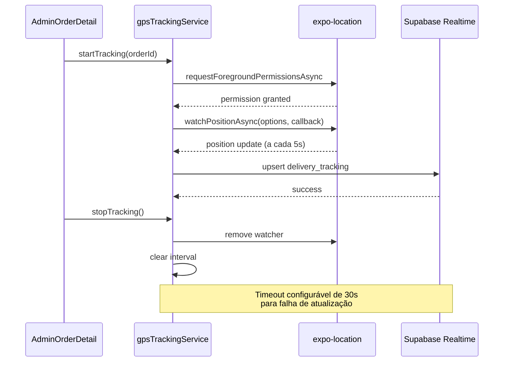
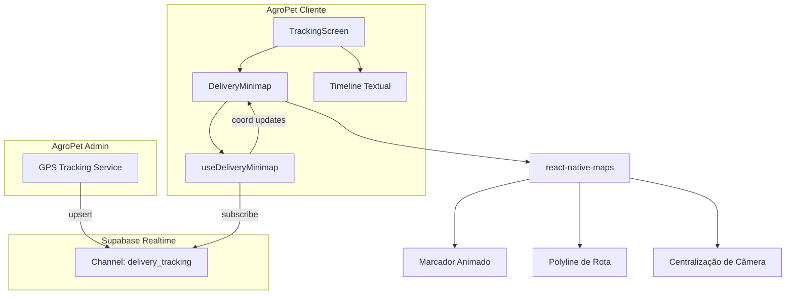

<div align="center">
  <h2>🎉 Relatório de Funcionalidades Concluídas — Sprint 3 🎉</h2>
  <h3>🚀 GPS Tracking, Legal Pages, Delivery Minimap e Correções de UX</h3>
  
  <p>Este relatório reúne e documenta com riqueza de detalhes as mecânicas avançadas desenvolvidas e integradas com sucesso absoluto no <b>Sprint 3 de Inovação</b> do ecossistema do <b>AgroPet Lambari</b>. Expandimos as capacidades de rastreamento GPS, conformidade legal e robustez da interface do usuário.</p>
</div>

<div align="center">

[]()
[]()
[]()
[]()

</div>

---

## 🛠️ O que foi Desenvolvido e Concluído no Sprint 3?

Neste terceiro ciclo de inovação, focamos em entregar rastreamento GPS funcional, conformidade legal com termos de uso e privacidade, um mapa de entrega dinâmico para o cliente e diversas correções de UX e expansão de testes:

1. **Telas de Política e Termos de Uso (LegalPages) — Cliente + Admin**
2. **Serviço de Rastreamento GPS em Tempo Real (Admin)**
3. **Delivery Minimap e Aprimoramentos de Rastreamento (Cliente)**
4. **Correções de UX e Expansão de Testes**

Abaixo, detalhamos o funcionamento, o impacto técnico e os diferenciais de UI/UX dessas entregas.

---

## ⚖️ 1. Telas de Política e Termos de Uso (LegalPages)

Implementamos as telas de documentação legal (Política de Privacidade e Termos de Uso) em ambos os aplicativos, garantindo conformidade regulatória e transparência para o usuário final.

### ✨ Arquitetura de Roteamento



- **Roteamento Dinâmico na AuthStack:** Ambas as stacks de autenticação (admin e cliente) recebem um parâmetro `documentType` no navigator (`'privacy' | 'terms'`), que direciona o `LegalPagesScreen` para renderizar o conteúdo correto.
- **Arquivo Compartilhado:** O componente `LegalPagesScreen.tsx`, o hook `useLegalPagesScreen.ts`, os estilos e o `index.ts` foram criados com estrutura idêntica em ambos os projetos, garantindo manutenção sincronizada.
- **Conteúdo Estático em Português Claro:** A política de privacidade detalha a coleta, uso e armazenamento de dados pessoais conforme a LGPD. Os termos de uso estabelecem as regras de utilização do serviço de e-commerce e delivery.

### 🧪 Cobertura de Testes

- **Admin (3 testes):** Renderização da política de privacidade, renderização dos termos de uso e fallback para tipo de documento inválido.
- **Cliente (3 testes):** Mesma bateria validando a tela no ecossistema do cliente.

---

## 📡 2. Serviço de Rastreamento GPS em Tempo Real (Admin)

Criamos um sistema completo de rastreamento GPS do entregador, permitindo que o admin inicie e pare o monitoramento de localização e persista os dados no Supabase em tempo real.

### ✨ Arquitetura do Serviço



- **gpsTrackingService (`agropet-admin/src/services/gpsTrackingService.ts`):** Serviço modular exportando funções `startTracking` e `stopTracking`. Utiliza `expo-location` para permissões e monitoramento em foreground. Persiste coordenadas na tabela `delivery_tracking` via Supabase com upsert.
- **Tratamento Robusto de Erros:** Timeout de 30s configurável para falha de atualização de localização. Se a permissão for negada, o serviço rejeita com erro claro.
- **useGpsTracking Hook (`agropet-admin/src/presentation/screens/admin/AdminOrderDetail/useGpsTracking.ts`):** Hook React que encapsula o ciclo de vida do tracking:
  - Estado `isTracking` (boolean) indicando se o monitoramento está ativo.
  - Estado `currentLocation` contendo `{latitude, longitude}` atual.
  - Estado `error` para falhas de permissão ou timeout.
  - Funções `startTracking(orderId)` e `stopTracking()` bindadas.
  - Limpeza automática (`useEffect` return) na desmontagem do componente.

### 🧪 Testes

Duas suites completas de teste:

| Suite | Arquivo | Cenários |
|-------|---------|----------|
| gpsTrackingService | `gpsTrackingService.test.ts` | Start/stop com sucesso, permissão negada, timeout de atualização |
| useGpsTracking | `useGpsTracking.test.ts` | Inicialização, parada limpa, limpeza na desmontagem, erro de permissão |

### 🗄️ Migration SQL (41)

```sql
-- add_delivery_tracking.sql
CREATE TABLE IF NOT EXISTS delivery_tracking (
  id BIGINT PRIMARY KEY GENERATED ALWAYS AS IDENTITY,
  order_id BIGINT NOT NULL REFERENCES orders(id),
  latitude DOUBLE PRECISION NOT NULL,
  longitude DOUBLE PRECISION NOT NULL,
  tracked_at TIMESTAMPTZ NOT NULL DEFAULT NOW(),
  created_at TIMESTAMPTZ NOT NULL DEFAULT NOW()
);
```

---

## 🗺️ 3. Delivery Minimap e Aprimoramentos de Rastreamento (Cliente)

Implementamos um mapa interativo de entrega no app do cliente, permitindo visualizar a posição do entregador em tempo real com animação suave.

### ✨ Arquitetura do Minimap



- **Componente DeliveryMinimap (`agropet-cliente/src/presentation/screens/client/Tracking/DeliveryMinimap.tsx`):**
  - Mapa customizado com `react-native-maps` exibindo a rota do entregador.
  - Marcador animado da posição atual com transição suave entre coordenadas.
  - Polígono de rota traçado conectando origem ao entregador.
  - Centralização dinâmica da câmera para seguir o entregador.
  - Estados de loading (ActivityIndicator) e erro (mensagem amigável).
  - Fallback silencioso quando não há dados de GPS disponíveis.

- **Hook useDeliveryMinimap (`agropet-cliente/src/presentation/screens/client/Tracking/useDeliveryMinimap.ts`):**
  - Assinatura ao canal Realtime `delivery_tracking` do Supabase.
  - Filtro por `order_id` para receber apenas coordenadas do pedido atual.
  - **Interpolação Suave:** Algoritmo que interpola entre a coordenada anterior e a nova em múltiplos passos, evitando "saltos" visuais do marcador no mapa.
  - Estados reativos: `currentLocation`, `routeCoordinates[]`, `isLoading`, `error`.
  - Limpeza automática da assinatura Realtime na desmontagem.

- **Integração com TrackingScreen:** A tela de rastreamento (`TrackingScreen.tsx`) foi expandida para incorporar o minimapa como visualização primária, mantendo a timeline textual como fallback quando o GPS do entregador estiver indisponível.

---

## 🐛 4. Correções de UX e Expansão de Testes

### 🔽 Dropdown Fechando ao Tocar Fora

**Problema:** O dropdown de ações nos cards de pedido (`OrderCard`) permanecia aberto mesmo quando o usuário tocava fora dele ou navegava para outra tela, causando sobreposição visual indesejada.

**Solução em 2 camadas:**
1. **Container Principal (`OrdersScreen.tsx`):** Adicionamos `onStartShouldSetResponderCapture={() => { closeAllDropdowns(); return false; }}` no `View` principal, capturando toques em qualquer área externa ao dropdown e fechando-o.
2. **Botão Detalhes (`OrderCard.tsx`):** Chamamos `closeAllDropdowns()` no `onPress` do botão Detalhes, garantindo que o dropdown feche ao navegar para o detalhe do pedido.

### 🗺️ Correção hasDeparted no AdminMapScreen

**Problema:** O balão de fala com informações da entrega (speech bubble) não era exibido para pedidos com status `completed`, pois a lógica `hasDeparted` verificava apenas status `delivering`.

**Solução:** Expandimos a condição para incluir `completed`:

```typescript
const hasDeparted = order.status === 'delivering' || order.status === 'completed';
```

### 🧪 Expansão de Testes

| Teste | Arquivo | Novos Cenários |
|-------|---------|----------------|
| shopHours | `shopHours.test.ts` | Horários de fim de semana, feriados, abertura/fechamento em borda |
| database (SQLite) | `database.test.ts` | Transações, rollback, concorrência simulada |
| ConnectivityContext | `ConnectivityContext.test.tsx` | Estados online/offline, transições |
| coverage-edge-cases | `coverage-edge-cases.test.tsx` | Casos extremos de cobertura |

---

## 📈 Resultados Finais

```
📊 Admin: 21 suites, 363 testes — 100% passando ✅
📊 Cliente: 15 suites, 145 testes — 100% passando ✅
📊 Total: 508 testes automatizados protegendo o ecossistema
📦 58 arquivos modificados, +2726 linhas adicionadas, -538 removidas
```

### ✅ TypeScript Type-Safety

```bash
npx tsc --noEmit (agropet-admin) => 0 Errors! ✅
npx tsc --noEmit (agropet-cliente) => 0 Errors! ✅
```

O ecossistema do **AgroPet Lambari** atinge mais um marco de maturidade técnica neste ciclo, com rastreamento GPS funcional, conformidade legal documentada, mapa de entregas interativo e uma suíte de 508 testes automatizados garantindo estabilidade operacional.

---

<div align="center">
  <sub>© 2026 Caio Magalhães. Desenvolvido para a AgroPet Lambari. Todos os direitos reservados.</sub>
</div>
