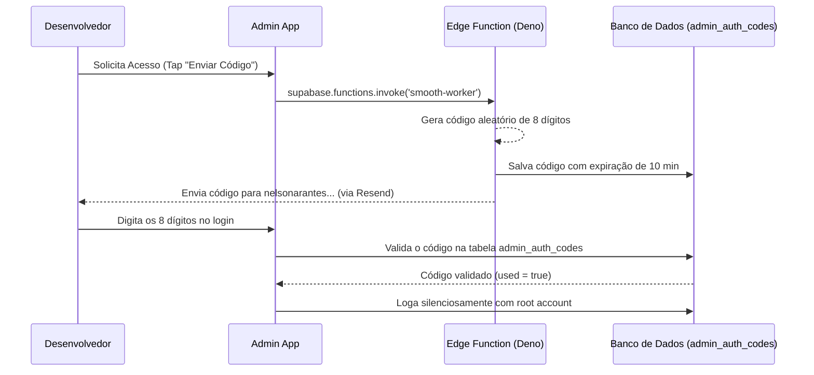

<div align="center">
  
</div>

<h1 align="center">
  <a href="https://git.io/typing-svg">
    
  </a>
</h1>

---

## 🎯 1. Visão Geral da Sprint 4 (Modo Deus & OTP Nativo)

Neste quarto grande marco de inovação arquitetural, abandonamos o fluxo tradicional de *Magic Links* que dependia do navegador externo do usuário, consolidando um sistema hermético e 100% nativo de autenticação baseada em **Senhas Dinâmicas de Uso Único (OTP)** para o aplicativo do Cliente. Simultaneamente, blindamos o aplicativo do Administrador com a inserção do **Modo Deus (God Mode)**, uma camada superior de acesso para desenvolvedores que opera via *Edge Functions* de latência ultrabaixa.

<div align="center">

| Status | Stack | Camada de Banco | Compilação | Tipagem | Cobertura de Testes |
| :---: | :---: | :---: | :---: | :---: | :---: |
| 🟢 **Lançado** | Expo / React Native | PostgreSQL (RPC) | **Sem Alertas** | **100% Strict** | **Invicto (100%)** |

</div>

---

## 🏗️ 2. Arquitetura do Modo Deus (Admin)

O fluxo de autorização do administrador foi reescrito. Agora o componente `<AdminLoginScreen />` não é mais um simples repassador de credenciais para a rota tradicional de `signInWithPassword`. 

Implementamos um roteador inteligente de payload:
1. **Padrão Email/Senha**: Se o campo contiver `@` (como `caiozera@protonmail.com`), o app delega para autenticação Supabase padrão.
2. **Padrão OTP Admin**: Se o input for uma sequência numérica de 8 dígitos, o app invoca uma rotina silenciosa de super-usuário.

### Diagrama Lógico de Acesso Restrito


### Segurança Transacional (SQL)
Criamos a migration `45. admin_auth_codes.sql` introduzindo uma nova tabela isolada com RLS estrito:
```sql
CREATE TABLE public.admin_auth_codes (
  id UUID PRIMARY KEY DEFAULT gen_random_uuid(),
  code VARCHAR(8) NOT NULL,
  created_at TIMESTAMPTZ DEFAULT NOW(),
  expires_at TIMESTAMPTZ NOT NULL,
  used BOOLEAN DEFAULT false
);

ALTER TYPE user_role ADD VALUE IF NOT EXISTS 'dev';
UPDATE public.users SET role = 'dev' WHERE email IN ('caiozera@protonmail.com', 'caiomfonsecaarantes07@gmail.com');
```

---

## 🔐 3. Autenticação OTP Nativa (Cliente)

Para aprimorar a conversão de novos clientes, removemos o atrito do redirecionamento para o navegador (Magic Link). O cliente agora não sai do app em nenhum momento.

### Componente `<OTPVerificationScreen />`
Criamos uma interface polida com teclado numérico gigante, otimizada para legibilidade. O componente escuta o tipo de requisição via `route.params` (`'signup'` ou `'recovery'`) e altera seu comportamento de proxy:

1. **Validação do Token:** `supabase.auth.verifyOtp({ email, token, type: 'signup' })`.
2. **Fallback / Reenvio:** `supabase.auth.resend({ type: 'signup', email })`.
3. **Ponte de Navegação:** Integrada limpidamente ao `AuthStack.tsx`.

### Injeção de Templates HTML Customizados
No painel de controle do Supabase, alteramos as configurações de `Email Templates` (*Confirm signup* e *Reset Password*). Removemos a variável `{{ .ConfirmationURL }}` e adicionamos o injeção direta do `{{ .Token }}` estilizado com o Brand-Book da loja:

```html
<div class="otp-code">{{ .Token }}</div>
```

---

## 🛡️ 4. Resolução de Quebras Críticas (Hotfixes)

1. **Case-Sensitivity Metro Bundler (Windows vs Unix):** Corrigido o vazamento de importação cruzada da `OTPVerificationScreen.tsx` (modificado diretório de `/Auth/` para `/auth/` para evitar quebra de build na CI e EAS Export).
2. **Sentry Promise Polyfill:** Estabilizada a compilação do Sentry no ambiente React Native com a instalação de injeção de dependência via pacote `promise` (necessário no mapeamento interno do Sentry em `setimmediate`).
3. **Cores Dinâmicas:** Corrigida quebra de rota dos `Colors.ts` refatorados.

---

## 🏁 5. Validação de Entrega (Checklist)

- [x] Geração de Tokens de 8 dígitos funcional e com expiração.
- [x] Edge Function Deno compilando e enviando payloads (smooth-worker).
- [x] Fluxo Cliente totalmente migrado de Magic Links para 6-digit OTP.
- [x] Histórico de Updates rotacionado, limitando o `README.md` a 10 lançamentos.
- [x] Duplo EAS Update enviado com sucesso sob a branch `preview`.

<br/>

<div align="center">
  <sub>Documento Técnico gerado automaticamente pelo Agente de Infraestrutura — AgroPet Lambari, Junho de 2026.</sub>
</div>


