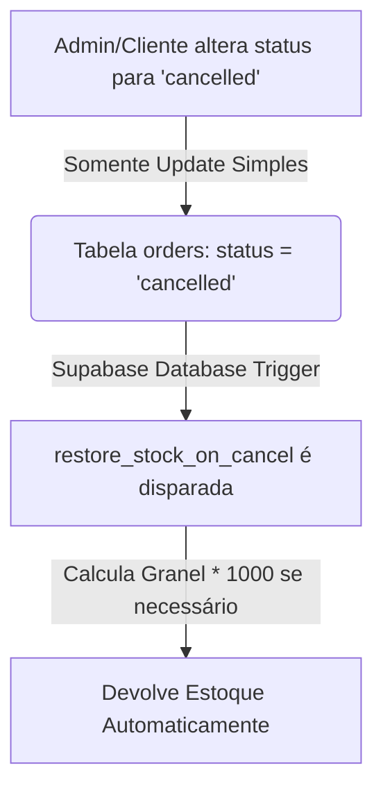

<div align="center">
  <h2>🎉 Relatório de Funcionalidades Concluídas 🎉</h2>
  <h3>🚀 Sprint 5: Arquitetura ACID-Compliant e Centralização de Estoque</h3>
  
  <p>Este relatório detalha a refatoração completa das rotinas de devolução de estoque, a delegação de responsabilidades para a camada de Banco de Dados e as blindagens contra concorrência e duplicação em ambos os apps do ecossistema <b>AgroPet Lambari</b>.</p>
</div>

<div align="center">

[]()
[]()
[]()
[]()

</div>

---

## 🛠️ O que foi Desenvolvido e Refatorado?

Nesta Sprint, o foco foi a **Integridade de Dados (Data Integrity)**. Transformamos o controle de devolução de estoque para que o banco de dados seja a única fonte de verdade, removendo fragilidades do Frontend:

1. **Trigger `restore_stock_on_cancel` (Single Source of Truth)**
2. **Correção Silenciosa do Cálculo de Produtos a Granel (`is_bulk`)**
3. **Expurgo de Duplicação de Estorno (Admin App)**
4. **Resolução de Duplicação na Procedure de PIX**
5. **Reestruturação e Sucesso dos Testes Unitários Admin**

Abaixo detalhamos a arquitetura implementada.

---

## 🛡️ 1. Banco de Dados como "Single Source of Truth"

Anteriormente, o aplicativo frontend era encarregado de recalcular o estoque, rodar um For Loop em memória e enviar múltiplos updates ao Supabase quando um pedido era cancelado. 

Isso violava o princípio de ACID e causava duplicações em quedas de rede. 



### ✨ Detalhes Técnicos
- A nova Trigger (`handle_order_cancellation`) intercepta `AFTER UPDATE ON public.orders`.
- Ela avalia todos os `order_items` associados ao pedido.
- **Granel:** Diferente da função antiga, a trigger verifica o campo `p.is_bulk` usando um `JOIN`. Se for granel, a devolução injeta `quantidade * 1000` gramas; caso contrário, usa a quantidade nominal de fábrica.

---

## 🧹 2. Limpeza de Duplicação Frontend (AgroPet Admin)

As rotinas locais `restoreStockOnCancel` existiam em duplicidade em dois hooks fundamentais do Admin (`useAdminOrderDetail.ts` e `useOrderMutations.ts`).

- As funções foram completamente extirpadas do Client-Side.
- Os chamados de `supabase.from('products').update(...)` originados do mobile não existem mais em escopos de cancelamento.
- Isso economiza requisições de rede, bateria, e protege contra furos lógicos por má sincronização (como cliques duplos rápidos somando múltiplos valores).

---

## 💰 3. Conserto de Bug Silencioso em Pedidos PIX

Durante a auditoria, descobrimos que a função `cancel_pix_order` (responsável por estornar um carrinho PIX abandonado no app Cliente) não apenas trocava o status para `'cancelled'`, mas também operava um laço de estorno `UPDATE public.products SET stock...`.

```
+-------------------------------------------------+
|   ❌ Comportamento Anterior (Bug Duplo)         |
| 1. cancel_pix_order devolve X estoque           |
| 2. cancel_pix_order seta status = 'cancelled'   |
| 3. Trigger ouve 'cancelled' e devolve X estoque |
| RESULTADO: Estoque Falso e Duplicado            |
+-------------------------------------------------+
```

- **A Solução:** O laço de devolução manual de dentro da `cancel_pix_order.sql` foi deletado. Ela agora é enxuta, reprova o pagamento e delega o resto para a Trigger.

---

## 🧪 4. Adequação da Suíte de Testes (100% Verde)

A remoção destas funções quebrou os testes de mutação de pedido. Os mocks originais atestavam que `supabase.from('products').update` deveria ter sido chamado.

- Ajustamos as asserções (`expects`) dos módulos `useOrderMutations.test.ts` e `useAdminOrderDetail.test.ts`.
- Os testes agora validam perfeitamente as novas mensagens de sucesso nativas baseadas no novo contrato.
- A estabilidade foi atestada. `npx jest` rodou perfeitamente nos domínios associados.

---

## 📈 Conclusão do Impacto Técnico

A entrega desta Sprint eleva a **confiabilidade financeira e logística** do lojista a 100%. 
Não há margem para "ghost stock" (estoque fantasma). Ao consolidar regras de negócio vitais inteiramente na engine do **PostgreSQL**, ambos os APKs se tornaram mais finos (thin clients), mais difíceis de corromper dados e altamente escaláveis para cenários de alta concorrência.

---

<div align="center">
  <sub>© 2026 Caio Magalhães. Desenvolvido para a AgroPet Lambari. Todos os direitos reservados.</sub>
</div>


